```mermaid
graph TD;
    A0-->n0(( 24));
    A1-->n0(( 24));
    A2-->n1((25 ));
    A3-->n1(( 25));
    A4-->n2(( 26));
    A5-->n2(( 26));
    A6-->n3(( 27));
    A7-->n3(( 27));
    A8-->n4(( 28));
    A9-->n4(( 28));
    A10-->n5(( 29));
    A11-->n5(( 29));
    A12-->n6(( 30));
    A13-->n6(( 30));
    A14-->n7(( 31));
    A15-->n7(( 31));
    A16-->n8(( 32));
    A17-->n8(( 32));
    A18-->n9(( 33));
    A19-->n9(( 33));
    A20-->n10(( 34));
    A21-->n10(( 34));
    A22-->n11(( 35));
    A23-->n11(( 35));
    n0 --> n12((36));
    n1 --> n12((36));
    n2 --> n13((37));
    n3 --> n13((37));
    n4 --> n14((38));
    n5 --> n14((38));
    n6 --> n15((39));
    n7 --> n15((39));
    n8 --> n16((40));
    n9 --> n16((40));
    n10 --> n17((41));

    n11 --> n17((41));
    n18{42};
    n19{43};
    n12 --> n20((44));
    n13 --> n20((44));
    n14 --> n20((44));
    n15 --> n20((44));
    n16 --> n21((45));
    n17 --> n21((45));
    n18 --> n21((45));
    n19 --> n21((45));
    n22{46};
    n23{47};
    n20 --> root((48));
    n21 --> root((48));
    n22 --> root((48));
    n23 --> root((48));

    style A5 fill:#FF6347,stroke:#333,stroke-width:2px;
    style A4 fill:#55ff33,stroke:#333,stroke-width:2px;
    style n3 fill:#55ff33,stroke:#333,stroke-width:2px;
    style n12 fill:#55ff33,stroke:#333,stroke-width:2px;
    style n14 fill:#55ff33,stroke:#333,stroke-width:2px;
    style n15 fill:#55ff33,stroke:#333,stroke-width:2px;
    style n21 fill:#55ff33,stroke:#333,stroke-width:2px;
    style n22 fill:#55ff33,stroke:#333,stroke-width:2px;
    style n23 fill:#55ff33,stroke:#333,stroke-width:2px;
    style root fill:#33d1ff,stroke:#333,stroke-width:2px;
```

# technical specs
the goal of the project is to generate a ZK proof proving that our published total equity & debt is calculated correctly by summing over all OKX's users equity & debt. We can also provide each individual user a merkle inclusion proof that its asset is part of the committed total asset of exchange. We achive this by constructing a global merkle sum tree (GMST) and generates ZK proof that the construction is correctly constructed.


## GMST



we divide all users into different batches.  Let `N` be the total number of users; and `M` be the `batch_size`. 

### batch tree
within each batch, we construct a binary tree, with each user's `account` as tree leaf. the data strucure of one `account` would be 
```rust
pub struct Account {
    pub id: String, // 256 bit hex string
    pub equity: Vec<F>, // vector of user's token equity, vector index will be 1-to-1 maped to a token, e.g `BTC` or `ETH`
    pub debt: Vec<F>, // vector of user's token debt
}
```
the `leaf_hash` is obtained by Poseidon Hashing users' account
```rust
let account_hash = PoseidonHash::hash_no_pad(vec![id, vec![sum_equity, sum_debt]]);
```
the binary tree internal node's hash & equity&debt sum is obtained by
```rust
let node_hash = PoseidonHash::hash_no_pad([left_child.hash, right_child.hash]);
let node_equity = left_child.equity + right_child.equity
let node_debt= left_child.debt + right_child.debt
```

### recursive tree
