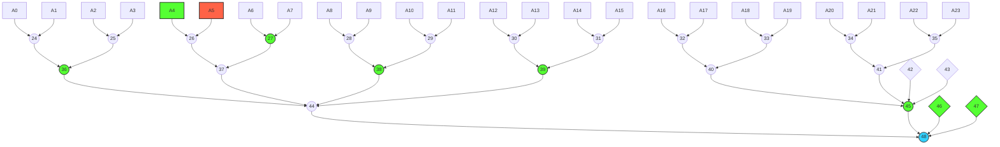

# gmst

```mermaid
graph TD;
    A0-->n0(( 24));
    A1-->n0(( 24));
    A2-->n1((25 ));
    A3-->n1(( 25));
    A4-->n2(( 26));
    A5-->n2(( 26));
    A6-->n3(( 27));
    A7-->n3(( 27));
    A8-->n4(( 28));
    A9-->n4(( 28));
    A10-->n5(( 29));
    A11-->n5(( 29));
    A12-->n6(( 30));
    A13-->n6(( 30));
    A14-->n7(( 31));
    A15-->n7(( 31));
    A16-->n8(( 32));
    A17-->n8(( 32));
    A18-->n9(( 33));
    A19-->n9(( 33));
    A20-->n10(( 34));
    A21-->n10(( 34));
    A22-->n11(( 35));
    A23-->n11(( 35));
    n0 --> n12((36));
    n1 --> n12((36));
    n2 --> n13((37));
    n3 --> n13((37));
    n4 --> n14((38));
    n5 --> n14((38));
    n6 --> n15((39));
    n7 --> n15((39));
    n8 --> n16((40));
    n9 --> n16((40));
    n10 --> n17((41));

    n11 --> n17((41));
    n18{42};
    n19{43};
    n12 --> n20((44));
    n13 --> n20((44));
    n14 --> n20((44));
    n15 --> n20((44));
    n16 --> n21((45));
    n17 --> n21((45));
    n18 --> n21((45));
    n19 --> n21((45));
    n22{46};
    n23{47};
    n20 --> root((48));
    n21 --> root((48));
    n22 --> root((48));
    n23 --> root((48));

    style A5 fill:#FF6347,stroke:#333,stroke-width:2px;
    style A4 fill:#55ff33,stroke:#333,stroke-width:2px;
    style n3 fill:#55ff33,stroke:#333,stroke-width:2px;
    style n12 fill:#55ff33,stroke:#333,stroke-width:2px;
    style n14 fill:#55ff33,stroke:#333,stroke-width:2px;
    style n15 fill:#55ff33,stroke:#333,stroke-width:2px;
    style n21 fill:#55ff33,stroke:#333,stroke-width:2px;
    style n22 fill:#55ff33,stroke:#333,stroke-width:2px;
    style n23 fill:#55ff33,stroke:#333,stroke-width:2px;
    style root fill:#33d1ff,stroke:#333,stroke-width:2px;
```