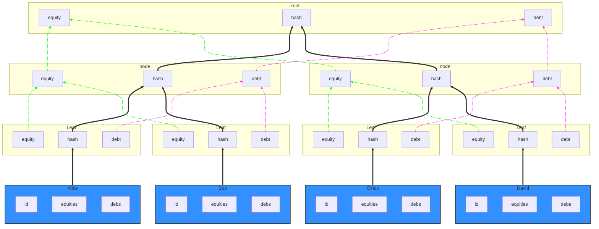
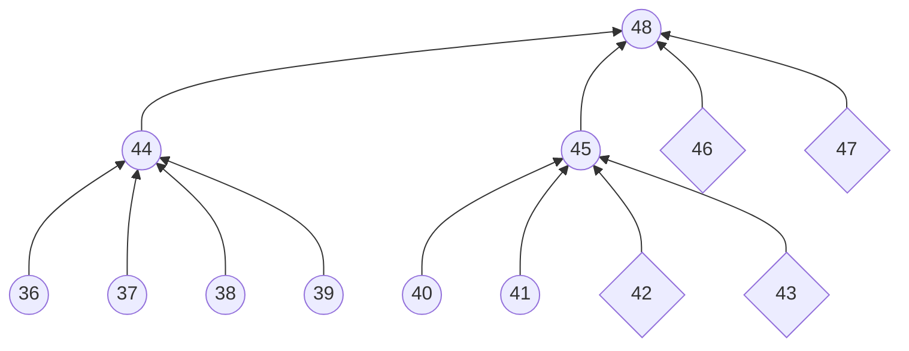

# technical specs
the goal of the project is to prove that the total equity & debt of an exchange is correct and verifiable. We achive this by constructing a global merkle sum tree (GMST) and generates ZK proof that the construction is correctly constructed. the root of the GMST will represent a commitment of the CEX's total equity & debt. We provide individual user a merkle inclusion proof that its asset is part of the committed total asset of exchange. 


## GMST

```mermaid
graph BT;
    A0-->n0(( 24));
    A1-->n0(( 24));
    A2-->n1((25 ));
    A3-->n1(( 25));
    A4-->n2(( 26));
    A5-->n2(( 26));
    A6-->n3(( 27));
    A7-->n3(( 27));
    A8-->n4(( 28));
    A9-->n4(( 28));
    A10-->n5(( 29));
    A11-->n5(( 29));
    A12-->n6(( 30));
    A13-->n6(( 30));
    A14-->n7(( 31));
    A15-->n7(( 31));
    A16-->n8(( 32));
    A17-->n8(( 32));
    A18-->n9(( 33));
    A19-->n9(( 33));
    A20-->n10(( 34));
    A21-->n10(( 34));
    A22-->n11(( 35));
    A23-->n11(( 35));
    n0 --> n12((36));
    n1 --> n12((36));
    n2 --> n13((37));
    n3 --> n13((37));
    n4 --> n14((38));
    n5 --> n14((38));
    n6 --> n15((39));
    n7 --> n15((39));
    n8 --> n16((40));
    n9 --> n16((40));
    n10 --> n17((41));

    n11 --> n17((41));
    n18{42};
    n19{43};
    n12 --> n20((44));
    n13 --> n20((44));
    n14 --> n20((44));
    n15 --> n20((44));
    n16 --> n21((45));
    n17 --> n21((45));
    n18 --> n21((45));
    n19 --> n21((45));
    n22{46};
    n23{47};
    n20 --> root((48));
    n21 --> root((48));
    n22 --> root((48));
    n23 --> root((48));

    style A5 fill:#FF6347,stroke:#333,stroke-width:2px;
    style A4 fill:#55ff33,stroke:#333,stroke-width:2px;
    style n3 fill:#55ff33,stroke:#333,stroke-width:2px;
    style n12 fill:#55ff33,stroke:#333,stroke-width:2px;
    style n14 fill:#55ff33,stroke:#333,stroke-width:2px;
    style n15 fill:#55ff33,stroke:#333,stroke-width:2px;
    style n21 fill:#55ff33,stroke:#333,stroke-width:2px;
    style n22 fill:#55ff33,stroke:#333,stroke-width:2px;
    style n23 fill:#55ff33,stroke:#333,stroke-width:2px;
    style root fill:#33d1ff,stroke:#333,stroke-width:2px;
```


- `square` means account node
- `circle` means internal node
- `tilt square` means padded node

**note**: we pad by empty node whenever it is needed to form a binary tree or multi branch recursive tree.

we divide all users into different batches. within each batch, we construct a binary tree, with each user's `account` as tree leaf. all roots of `batch_tree` will form a `recursive_tree`, whose branch numbers can be configured (denoted by `B`); Let `N` be the total number of users; and `M` be the batch size. in above's example, `N=24`, `M=4`, `B=4`;

### batch tree

- solid black line represents Hashing relationship
- dash line represents Sum relationship
- dash green line is for summation relationship of equities; while dash purple line is for summation relationship of debts.

 the data strucure of one `account` would be 
```rust
pub struct Account {
    pub id: String, // 256 bit hex string
    pub equity: Vec<F>, // vector of user's token equity, vector index will be 1-to-1 maped to a token, e.g `BTC` or `ETH`
    pub debt: Vec<F>, // vector of user's token debt
}
```
the `leaf_hash` is obtained by Poseidon Hashing users' account
```rust
let account_hash = PoseidonHash::hash_no_pad(vec![id, vec![sum_equity, sum_debt]]);
```
the binary tree internal node's hash, equity&debt sum is obtained by
```rust
let node_hash = PoseidonHash::hash_no_pad([left_child.hash, right_child.hash]);
let node_equity = left_child.equity + right_child.equity;
let node_debt= left_child.debt + right_child.debt;
```

### recursive tree

for recursive tree, we calculate the node hash, node equity & debt similar to the method in batch tree; the only difference is that the tree branching number might not be 2, and the actual value is configurable.
```rust
let node_hash = PoseidonHash::hash_no_pad([...children.hash]);
let node_equity = sum([...children.equity])
let node_debt= sum([...children.debt])
```

### root
- the root node hash represents the commitment of all user's assets info. 
- the root node's equity & debt will be the total equity & debt of the exchange.

### merkle proof
for each given account, we can generate a merkle inclusion proof for that user. for example as in the above graph, the merkle proof for account `A5` would be
```json
{
    "index": 6,
    "account": {
        "debt": [
            0,
            0,
            0, // ...
        ],
        "equity": [
            13497160,
            194918,
            12864849, // ...
        ],
        "id": "7f560c5e8193157ba9a327df47f002fe2c648738ae843ce342f92e821a2bdb47"
    },
    "sum_tree_siblings": ["A4", "27"],
    "recursive_tree_siblings": [
        {
            "left_hashes": ["36"],
            "right_hashes": ["38", "39"]
        }  ,
        {
            "left_hashes": [],
            "right_hashes": ["45", "46", "47"]
        }      
    ]
}
```

## ZKP
During the construction of batch tree, we generate ZK proof that the batch tree is constructed correctly; and during the construction of recursion 
tree, we generate ZK proof that the children tree's proof is correct and the recursion building logic is constrained. 

### batch circuit
**public input**
- batch root hash

**private input**
- users account info

**circuit constraints**

$$Account_{i}.Equity == \sum_j^{Q} Asset_{j}.Equity$$

$$Account_{i}.Debt == \sum_j^{Q} Asset_{j}.Debt$$

$$Account_{i}.Equity \ge Account_{i}.Debt$$

$$Leaf_{i}.Hash == Poseidon(accounts)$$

$$(Node|Root).Hash == Poseidon(leftChild.Hash || rightChild.Hash)$$

$$(Node|Root).Equity == Sum(leftChild.Equity || rightChild.Equity)$$

$$(Node|Root).Debt == Sum(leftChild.Debt || rightChild.Debt)$$

where 
$$j \in [0,Q), i \in [0,M)$$
and `Q` is total number of assets; `M` is the number of users in one batch

### recursive circuit
**public input**
- recursive tree root hash

**private input**
- batch tree proof
- batch tree root hash
- batch tree root equity
- batch tree root debt

**circuit constraints**

$$ Verify(Proof_i) == True $$

$$(Node).Hash == Poseidon([child.Hash; B])$$

$$(Node).Equity == Sum([child.Equity; B])$$

$$(Node).Debt == Sum([child.Debt; B])$$

where 
$$i \in [0,B)$$

and `B` is the branching number of recursive tree


